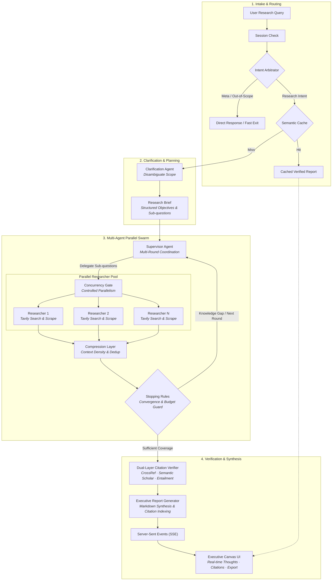

# Deep Research Agent

<p align="center">
  <a href="#license"></a>
  
  
  
  
</p>

An open-source deep-research workbench built around LangGraph. It decomposes complex research questions into reviewable plans, orchestrates parallel web investigations, verifies academic and web sources, and streams cited Markdown reports back to a modern React interface.

Provider-agnostic by design: works with OpenAI, Anthropic, or any OpenAI-compatible API gateway (Groq, Cerebras, OpenRouter, local Ollama, vLLM, LM Studio). Provider credentials and routing live strictly in server-side configuration, never exposed to the frontend bundle.

---

<p align="center">
  
</p>

---

## Key Features

- **Interactive Research Planning**: Automatically decomposes broad inquiries into multi-step execution plans that users can review, edit, or expand before running.
- **Parallel Multi-Agent Swarm**: Implements the supervisor–researcher pattern on LangGraph, orchestrating parallel worker nodes through a controlled Concurrency Gate.
- **Dual-Layer Citation Verification**: Validates academic papers, DOIs, and claims against CrossRef and Semantic Scholar to eliminate fabricated references.
- **Live Thought & Source Streaming**: Real-time Server-Sent Events (SSE) stream the agent's internal reasoning, active search queries, and discovered sources directly to the UI.
- **Provider-Agnostic Engine**: Configure distinct models for high-level orchestration (`brain`) and high-throughput research (`worker`) across OpenAI, Anthropic, Groq, Cerebras, or self-hosted Ollama/vLLM instances.
- **Executive Markdown Canvas**: Reading view with interactive citation popovers, table of contents, and one-click Markdown export.

## Architecture

<p align="center">
  
</p>

<details>
<summary><b>View Interactive Mermaid Flowchart</b></summary>



</details>

### Pipeline Design

- **Intake & Intent Arbitration**: Fast-routes meta-commands and conversational queries to prevent unnecessary multi-agent overhead, while querying semantic cache fingerprints to instantly return previously verified findings.
- **Clarification & Brief Generation**: Interactively disambiguates inquiries and generates a structured research contract (`objective`, `sub_questions`, `constraints`) reviewable in the workbench before launch.
- **Supervisor–Researcher Swarm**:
  - **Supervisor**: Analyzes coverage gaps each round, formulates targeted follow-up queries, and enforces deterministic stopping rules.
  - **Concurrency Gate**: Throttles parallel researcher execution via `asyncio.Semaphore` to stay within upstream API rate limits.
  - **Compression**: Condenses raw web findings into atomic bullet notes, keeping prompt contexts compact and noise-free.
- **Dual-Layer Citation Verification**: Validates claims against source text (Layer 1: Entailment) and cross-references academic papers and DOIs against CrossRef and Semantic Scholar (Layer 2: Registry Verification) to eliminate hallucinations.
- **Clean Architecture Boundary**: Domain nodes communicate exclusively through lightweight protocols defined in `src/infra/interfaces.py`. Infrastructure drivers (LLM providers, search clients, checkpointers) remain isolated at the boundary, allowing seamless model and provider swapping.

## Quick Start

### Prerequisites
- Python 3.12 or 3.13 with [uv](https://docs.astral.sh/uv/) installed
- Node.js 20+ and npm

### 1. Backend Setup

```bash
# Clone the repository
git clone https://github.com/<owner>/deep-research.git
cd deep-research

# Install Python dependencies
uv sync --extra dev

# Copy environment and provider configuration
copy .env.example .env                       # Windows
# cp .env.example .env                       # macOS / Linux
copy config/providers.example.json config/providers.json
```

Configure `.env` and `config/providers.json` with your preferred model credentials and `TAVILY_API_KEY` (Tavily search is optional for test runs).

Start the backend API server:
```bash
uv run uvicorn api.app:app --app-dir src --host 127.0.0.1 --port 8000 --reload
```

### 2. Frontend Setup

In a new terminal window:
```bash
cd frontend
npm ci
npm run dev
```

Open [http://localhost:3000](http://localhost:3000). Vite automatically proxies `/research`, `/api`, and `/health` requests to the backend at port 8000.

## Provider Configuration

Model configuration is managed via `config/providers.json` (ignored by Git to keep credentials private). You can configure separate models for the strategic `brain` role and the parallel `worker` role:

```json
{
  "roles": {
    "brain": {
      "primary": [{
        "provider": "my-gateway",
        "protocol": "openai-compatible",
        "model": "my-brain-model-id",
        "base_url": "https://gateway.example.com/v1",
        "api_key_env": "MY_GATEWAY_API_KEY",
        "supports_tools": true
      }],
      "fallback": null
    },
    "worker": {
      "primary": [{
        "provider": "my-gateway",
        "protocol": "openai-compatible",
        "model": "my-worker-model-id",
        "base_url": "https://gateway.example.com/v1",
        "api_key_env": "MY_GATEWAY_API_KEY",
        "supports_tools": true
      }],
      "fallback": null
    }
  }
}
```

- **Supported Protocols**: `"openai-compatible"` (OpenAI, Groq, Cerebras, OpenRouter, Ollama, vLLM) and `"anthropic"` (native Messages API).
- **Cooldown & Fallback**: The model router automatically isolates rate limits `(provider, model)` and seamlessly fails over to backup providers when configured.

## API Reference

| Method | Endpoint | Description |
| --- | --- | --- |
| `GET` | `/health` | Service liveness check |
| `GET` | `/ready` | Configuration and readiness check |
| `POST` | `/research/plan` | Generate an initial reviewable research plan |
| `POST` | `/research` | Run the pipeline synchronously and return the report |
| `POST` | `/research/stream` | Stream graph progress, thoughts, sources, and report via SSE |
| `GET` | `/api/latest-report` | Retrieve the latest generated report |

## Development & Testing

Run the automated test suite and code linters:

```bash
# Run backend tests (fast, network-free with mocks)
uv run pytest -q

# Lint Python code
uv run ruff check .

# Check frontend
cd frontend
npm run lint
npm run build
```

## Docker Deployment

Run the complete application (FastAPI backend, Vite frontend, and PostgreSQL) with Docker Compose:

```bash
docker compose up --build
```

The frontend will be accessible at `http://localhost:3000` and the API at `http://localhost:8000`. See [`docs/deployment.md`](docs/deployment.md) for configuration details.

## Repository Layout

```text
src/                  Clean Architecture domain modules, graph assembly, and API
frontend/             React + Vite workbench interface
config/               Safe provider configuration templates
docs/                 Architecture documentation, deployment guides, and specs
tests/                Automated unit and integration test suite
```

## Responsible Use

Research output generated by language models can be incomplete or contain inaccuracies. Always inspect the cited sources before relying on a report. Respect provider terms of service, website robots.txt policies, copyright, and applicable laws.

## Acknowledgements & Attributions

- **Architecture Inspiration**: Multi-agent supervisor–researcher pattern adapted from [`langchain-ai/open_deep_research`](https://github.com/langchain-ai/open_deep_research).
- **UI Assets**:
  - `ai-logo.svg` created by Mol Media ([Noun Project](https://thenounproject.com/)).
  - `new-chat.svg` created by Gregor Cresnar ([Noun Project](https://thenounproject.com/)).

## License

Distributed under the MIT License. See [`LICENSE`](LICENSE) for details.
