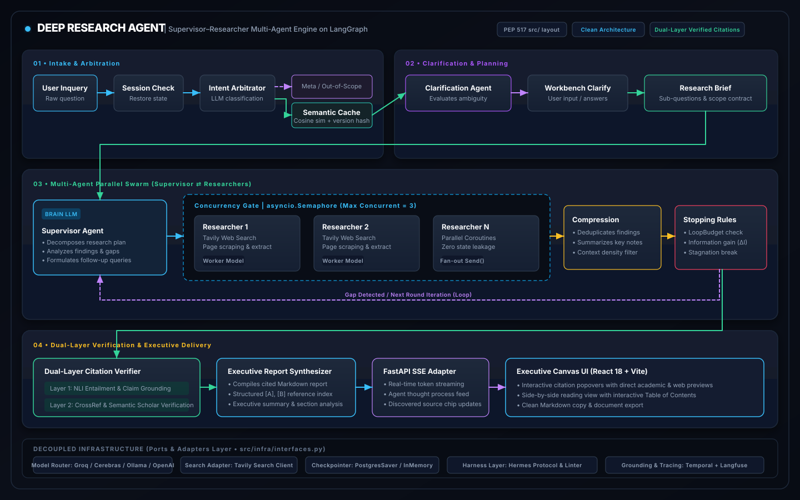
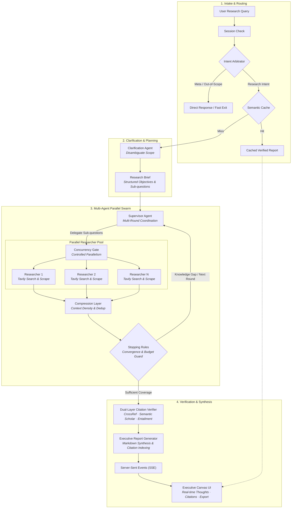

# Kiến trúc — Deep Research Agent

> **Tài liệu này mô tả kiến trúc thực tế của hệ thống tính đến Phase 22.**
> Đọc khi PLANNING bất kỳ thay đổi nào chạm tới flow tổng thể, khi cần hiểu vì sao một thành phần tồn tại, hoặc khi onboarding người mới.

---

## Tổng quan

Deep Research Agent là một hệ thống nghiên cứu tự động chạy trên **LangGraph**, được thiết kế cho **người dùng phổ thông** muốn tìm hiểu sâu về bất kỳ chủ đề nào. Hệ thống tự động tìm kiếm, tổng hợp và viết báo cáo có trích dẫn nguồn. Runtime hỗ trợ cấu hình provider/model tuỳ ý qua `config/providers.json` (OpenAI, Anthropic, Groq, Cerebras, OpenRouter, Ollama, vLLM...).

**Stack chính:**
- **Orchestration:** LangGraph (Python)
- **LLM:** Provider/model tuỳ ý qua `config/providers.json` hoặc environment
- **Local SLM:** Ollama hoặc bất kỳ OpenAI-compatible local gateway nào
- **Search:** Tavily (free tier)
- **API:** FastAPI + SSE streaming
- **Frontend:** Vite + React 19 + Tailwind CSS v4
- **Checkpointer:** PostgresSaver (Supabase) / InMemorySaver (dev)

---

## Pipeline — Sơ đồ flow thực tế

<p align="center">
  
</p>



### Giải thích luồng

1. **Session Check**: Khôi phục state từ checkpoint nếu có, tránh chạy lại từ đầu.
2. **Intent Arbitrator**: Phân loại request (OUT_OF_SCOPE / META_COMMAND / RESEARCH) — ngăn câu hỏi meta đơn giản kích hoạt cả pipeline nghiên cứu tốn kém.
3. **Semantic Cache**: Cosine similarity trên câu hỏi. Bắt buộc có `version fingerprint` + `dev-bypass`.
4. **Clarify → Research Brief**: Làm rõ mục tiêu nghiên cứu → sinh brief có cấu trúc (`objective`, `sub_questions`, `constraints`).
5. **Supervisor ⇄ Researcher Pool**: Vòng lặp multi-round. Supervisor quyết định sub-topics, fan-out N researcher qua `Send()`, mỗi researcher chạy cô lập qua Concurrency Gate (max N=3). Sau mỗi round, Compression nén findings, kiểm tra `should_force_stop`.
6. **Verification**: Dual-Layer Citation Verifier — Layer 1: LLM entailment check. Layer 2: URL validity.
7. **Reporting**: Sinh báo cáo Markdown với trích dẫn dạng `[A]`, `[B]`, `[C]`.

---

## Cấu trúc thư mục

```
Deep Research/
├── src/                          # Toàn bộ mã nguồn backend
│   ├── api/                      # FastAPI application (REST + SSE endpoints)
│   ├── clarify/                  # Node: làm rõ mục tiêu
│   ├── research_brief/           # Node + Domain logic: sinh brief có cấu trúc
│   ├── supervisor/               # Node + Domain logic: điều phối vòng lặp (stopping_rules, concurrency_gate)
│   ├── researcher/               # Node: cào và tổng hợp dữ liệu web
│   ├── compression/              # Node: nén findings giữa các round
│   ├── verification/             # Node + Domain logic: dedup + citation verify
│   ├── reporting/                # Node: sinh báo cáo Markdown + citation registry
│   ├── caching/                  # Domain logic: semantic cache fingerprint
│   ├── state/                    # State schemas (TypedDict: AgentState, SupervisorState, ResearcherState)
│   ├── infra/                    # Infrastructure layer (model_router, search_client, harness guard...)
│   └── graph.py                  # Graph assembly — NƠI DUY NHẤT wiring LangGraph
│
├── frontend/                     # Vite + React 19 + Tailwind CSS v4
│   └── src/
│       ├── App.tsx               # Root component: Sidebar + ChatFeed + ResearchCanvas
│       ├── main.tsx              # Entry point
│       ├── index.css             # Tailwind CSS v4 + theme tokens
│       ├── components/           # UI components (xem docs/frontend.md)
│       ├── hooks/                # useResearchApi.ts — SSE + REST
│       ├── types/                # TypeScript interfaces
│       └── public/               # Static assets
│
├── tests/                        # 21 test files, 150+ tests
├── docs/                         # Tài liệu hệ thống
├── config/                       # Template cấu hình providers mẫu
├── Dockerfile                    # Containerization
├── docker-compose.yml            # Multi-container orchestration
├── .env.example                  # Environment template
└── .gitignore
```

---

## 3 tầng State (ephemeral — khác Checkpointer là persistent)

| Tầng | Scope | File |
|---|---|---|
| `AgentState` | Toàn flow — từ user query đến final report | [`state/schema.py`](../state/schema.py) |
| `SupervisorState` | Điều phối — brief, notes, round counter | [`state/schema.py`](../state/schema.py) |
| `ResearcherState` | Cô lập theo từng researcher — KHÔNG chia sẻ | [`state/schema.py`](../state/schema.py) |

`ResearchGraphState` (trong [`graph.py`](../graph.py)) mở rộng `AgentState` thêm `raw_findings`, `visited_urls`, `intent`, `cache_hit` — sử dụng `operator.add` reducer cho fan-in song song.

---

## Ranh giới Clean Architecture

```
┌────────────────────────────────────────────────────┐
│  Domain Logic (pure Python, test không cần network) │
│  research_brief/validation.py                       │
│  supervisor/stopping_rules.py                       │
│  verification/dedup.py                              │
│  caching/fingerprint.py                             │
│  infra/harness/convergence.py, observation_filter   │
├────────────────────────────────────────────────────┤
│  Node Functions (*/node.py)                         │
│  - Được phép import LangGraph types                 │
│  - Gọi LLM/Search qua Protocol, KHÔNG trực tiếp    │
├────────────────────────────────────────────────────┤
│  Graph Assembly (graph.py)                          │
│  - NƠI DUY NHẤT wiring LangGraph StateGraph        │
├────────────────────────────────────────────────────┤
│  Infrastructure (infra/)                            │
│  - model_router.py, search_client.py, checkpointer  │
│  - Humble Objects: mỏng, ngu ngơ, I/O thật         │
│  - Thay thế được mà không đụng domain logic         │
└────────────────────────────────────────────────────┘
```

**Quy tắc bất biến:**
- Node KHÔNG import trực tiếp `groq`, `litellm`, `tavily` — chỉ qua `infra/interfaces.py`
- File ngoài `graph.py` và `*/node.py` KHÔNG import `langgraph`
- Domain logic KHÔNG gọi network trực tiếp

---

## Model Routing

The runtime does not require a specific provider or model. Configure one or
more primary entries and an optional fallback in `config/providers.json`.
Cloud, local, hosted Ollama, Anthropic-native, and OpenAI-compatible gateways
can be mixed as long as the selected models support the capabilities required
by the pipeline. The cooldown key is `(provider, model)`.

The optional local worker path can route researcher/compression work through
Ollama or another local OpenAI-compatible gateway; it is disabled unless
explicitly configured.

---

## Harness Guard Layer

Nằm giữa Node Functions và hạ tầng bên ngoài, tổng hợp từ Hermes SETP + DeepSeek Rule-Based Verifiers + SWE-agent ACI:

| Component | Chức năng |
|---|---|
| **Hermes SETP Linter** | Chuẩn hóa query, synthetic error reflection ($0 cost) |
| **Domain Authority Scorer** | Tier A/B/C — loại 100% spam (Tier C) |
| **Observation Density Filter** | BM25 top-3 đoạn giàu dữ liệu nhất cho Local SLM |
| **Convergence ΔI Guard** | Đo bão hòa tri thức, tự dừng khi ΔI < threshold |

Các guard của harness được triển khai trong thư mục [`infra/harness/`](../infra/harness/). Ghi chú thiết kế nội bộ không nằm trong bản phát hành public.

---

## Temporal Grounding

[`infra/temporal.py`](../infra/temporal.py) tự động gắn mốc thời sự (năm hiện tại) vào truy vấn chứa từ khóa thời sự ("mới nhất", "hiện nay", "gần đây"), ngăn model trả lời bằng dữ liệu cũ trong training data.

---

## Observability

- **Langfuse tracing** ([`infra/tracing.py`](../infra/tracing.py)): Bật từ đầu, không để tới lúc debug mới thêm.
- **Pay-as-you-go cost tracking**: Mỗi LLM call ghi `latency_seconds` + `cost_usd` từ pricing catalog trong Model Router.
- **XAI Glass-Box logging**: Log từng quyết định của Supervisor, Researcher, Harness cho phép audit hậu kiểm.
